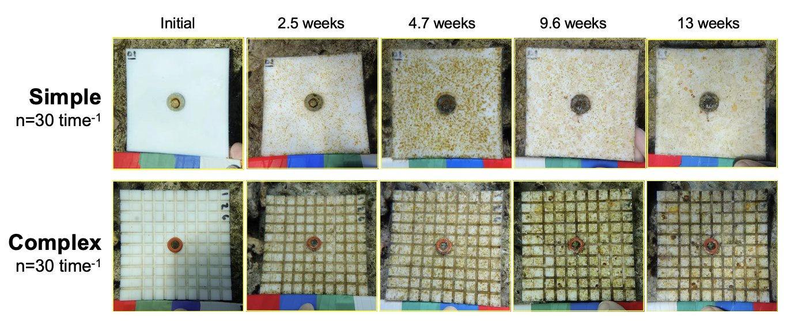

Understanding the drivers and impacts of spatiotemporal variation in species abundance on community trajectories is key to understanding the factors contributing to ecosystem resilience. Temporal variation in species trajectories across patches can provide compensation for species loss and can influence successional patterns. However, little is known about the underlying mechanisms that lead to patterns of species or spatial compensation and how those patterns may be mediated by consumer–resource relationships.

In Mo'orea, French Polynesia we tested how habitat attributes influence the behavior of fish herbivores leading to variation in the trajectory of algal communities. We used settlement plates varying in structural complexity to simulate accessibility to herbivores and the presence of surrounding *Turbinaria ornata* stands to simulate detectability to herbivores. By creating mosaics of herbivore accessibility (i.e., tiles of mixed accessibility) we tested how habitat heterogeneity influences algal community trajectories at metacommunity scale. After 90 days, reducing herbivore accessibility reduced herbivory, increased algal richness, and led to variation in algal community trajecctories at metacommunity scale.

The results of this work indicate that habitat attributes can be important influencers of consumer–resource interactions on coral reefs, which in turn can increase species diversity, promote species succession, and enhance stability in algal metacommunities.

We've got some more work coming down the pipeline on this! But in the meantime, be sure to check out our recent paper in [Ecology Articles](https://esajournals.onlinelibrary.wiley.com/doi/full/10.1002/ecy.3976)!

